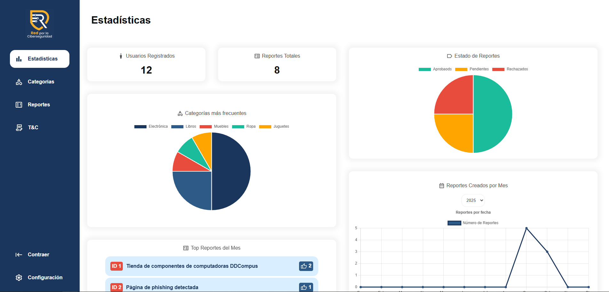

#  Red por la Ciberseguirdad Administrator Dashboard



##  Overview

**Web Dashboard** is a **React-based web application** built using **Vite** for fast builds and instant hot reloads.  
It uses **React Router DOM** for navigation and **Framer Motion** for smooth animations.

---

##  Prerequisites

Before setting up the project, make sure you have the following installed:

- **Node.js** (v18 or higher recommended)  
- **npm** (comes with Node.js)  
- A code editor like **VS Code**
- Git installed
---

##  Installation

1. **Clone the repository**

   ```bash
   git clone https://github.com/romavallejo/web-dashboard.git
   ```

2. **Navigate to the project directory**

   ```bash
   cd web-dashboard
   ```

3. **Install dependencies**

   ```bash
   npm install
   ```

---

##  Setting up .env file

Create a .env file at the root level of the project, in it write down a line as follows making the link equal to the actual API used.

   ```bash
   VITE_BACKEND_URL=http://you-actual-api-IP
   ```
---

##  Running the Project

Start the development server with:

```bash
npm run dev
```

By default, the app will be available at:

 [http://localhost:5173](http://localhost:5173)

---

##  Project Structure

```
src/
 ┣ components/     # Reusable UI components
 ┣ pages/          # Page-level views (used with React Router)
 ┣ App.jsx         # Main app component
 ┣ main.jsx        # Entry point
```

---

##  Dependencies

| Package | Purpose |
|----------|----------|
| **react-router-dom** | Handles navigation between pages |
| **framer-motion** | Provides animations and transitions |

---

##  Scripts

| Command | Description |
|----------|-------------|
| `npm run dev` | Starts the Vite development server |
| `npm run build` | Builds the app for production |
| `npm run preview` | Serves the production build locally for testing |

---

##  Deployment

To create a production build:

```bash
npm run build
```

This command generates an optimized **`dist/`** folder that you can deploy to any static hosting provider, such as:

- **Vercel**
- **Netlify**
- **GitHub Pages**
- **Azure Static Web Apps**

---


